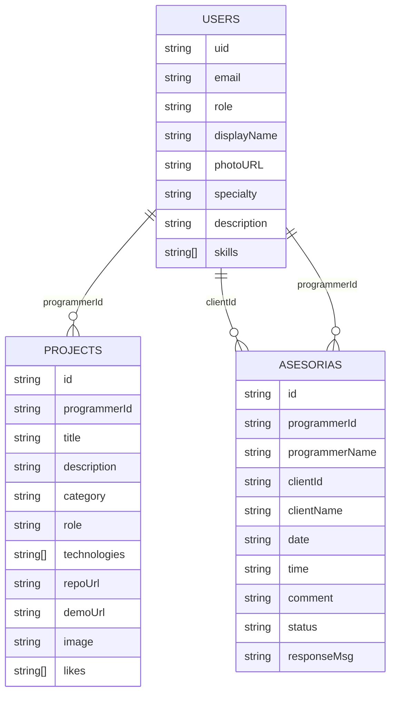

# Diagrama de entidades (ER)

Este diagrama representa las entidades principales del proyecto y sus relaciones, basadas en las interfaces actuales.

```mermaid
erDiagram
  USERS {
    string uid
    string email
    string role
    string displayName
    string photoURL
    string specialty
    string description
    string[] skills
  }

  PROJECTS {
    string id
    string programmerId
    string title
    string description
    string category
    string role
    string[] technologies
    string repoUrl
    string demoUrl
    string image
    string[] likes
  }

  ASESORIAS {
    string id
    string programmerId
    string programmerName
    string clientId
    string clientName
    string date
    string time
    string comment
    string status
    string responseMsg
  }

  USERS ||--o{ PROJECTS : "programmerId"
  USERS ||--o{ ASESORIAS : "clientId"
  USERS ||--o{ ASESORIAS : "programmerId"
```
